# Sprawozdanie - Zadanie 1

**Autor:** Anna Wójcik <br>
**Link do DockerHub:** https://hub.docker.com/repository/docker/annawojcik1/pawcho-weather/general

## 1. Treść utworzonego pliku Dockerfile

```dockerfile
# syntax=docker/dockerfile:1.2

# ETAP 1: Klonowanie repozytorium przez SSH
FROM alpine:3.19 AS builder

# Instalacja klienta git i ssh
RUN apk add --no-cache git openssh-client

# Konfiguracja zaufanych hostów dla GitHuba
RUN mkdir -p -m 0700 ~/.ssh && ssh-keyscan github.com >> ~/.ssh/known_hosts

WORKDIR /build

# Pobranie plików z repozytorium GitHub wykorzystując klucz SSH maszyny budującej
RUN --mount=type=ssh git clone git@github.com:anna-wojcik/pawcho-zadanie1.git .

# ETAP 2: Ostateczny, lekki obraz docelowy
FROM alpine:3.19

# Etykieta zgodna ze standardem OCI (informacja o autorze)
LABEL org.opencontainers.image.authors="Anna Wójcik"

WORKDIR /app

# Optymalizacja warstw: kopiowanie tylko niezbędnych plików z etapu budowania
COPY --from=builder /build/index.html /build/run.sh ./

# Nadanie uprawnień do wykonania skryptu startowego
RUN chmod +x run.sh

# Informacja o porcie
EXPOSE 3000

# Healthcheck sprawdzający czy serwer odpowiada
# wget jest lekkim narzędziem wbudowanym w Alpine, zamiast instalować curl
HEALTHCHECK --interval=30s --timeout=3s --retries=3 \
  CMD wget -qO- http://localhost:3000/ || exit 1

# Uruchomienie aplikacji
CMD ["/app/run.sh"]

```

## Utworzenie buildera opartego na sterowniku docker-container
`docker buildx create --name=zadanie1-builder --driver docker-container --use --bootstrap`

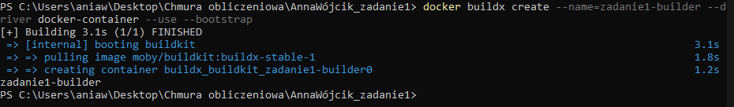

## Zbudowanie opracowanego obrazu kontenera
`docker buildx build --ssh default --platform linux/amd64,linux/arm64 -t docker.io/annawojcik1/pawcho-weather:v1 --cache-to type=registry,ref=docker.io/annawojcik1/pawcho-weather:cache,mode=max --cache-from type=registry,ref=docker.io/annawojcik1/pawcho-weather:cache --push .`

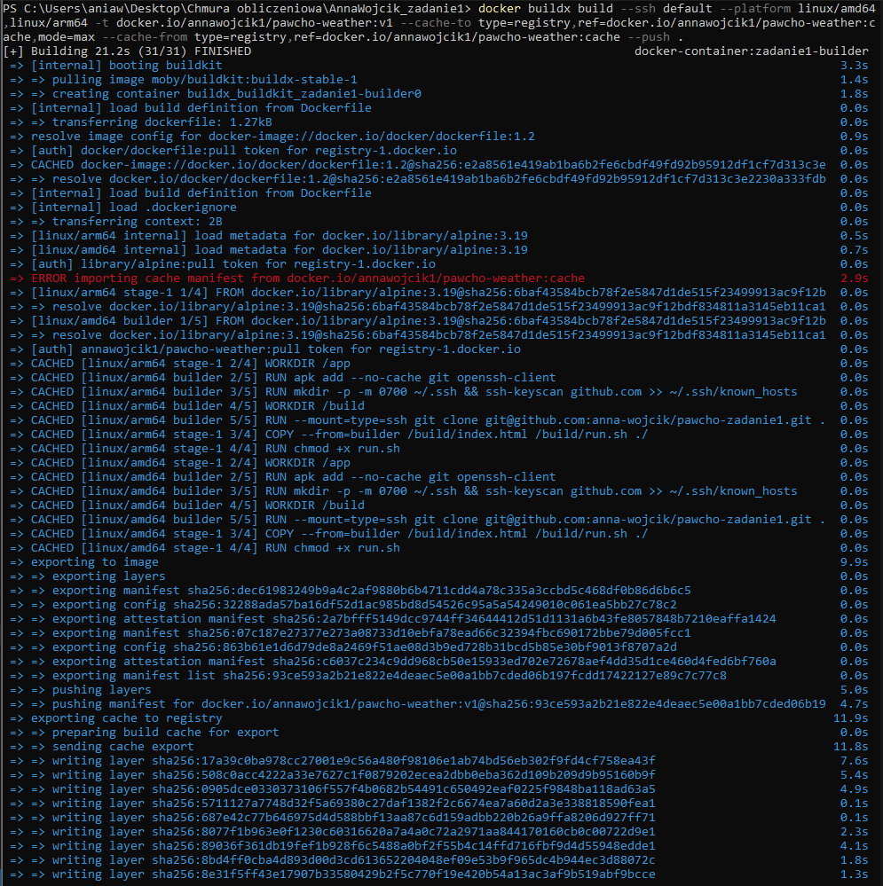
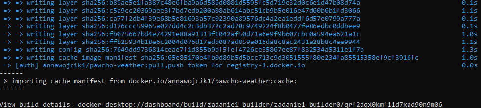

Błąd `=> ERROR importing cache manifest from docker.io/annawojcik1/pawcho-weather:cache` jest całkowicie normalny, gdyż Docker próbował pobrać cache manifestu z DockerHuba i go tam nie znalazł ze względu na to, że budujemy obraz jak i wysyłamy cache po raz pierwszy.

## Weryfikacja platform i manifestu
`docker buildx imagetools inspect docker.io/annawojcik1/pawcho-weather:v1`

Fragment "Platform: linux/amd64" oraz "Platform: linux/arm64" udowadnia, że obraz jest wieloarchitekturowy.

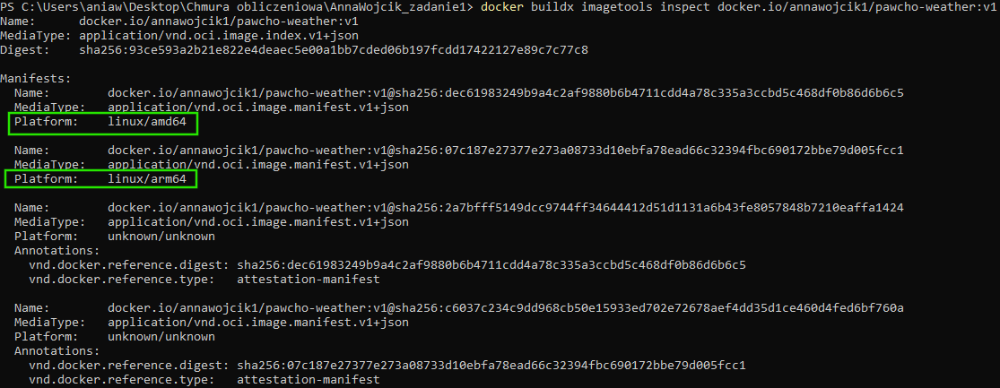

## Dowód utworzenia obrazu cache
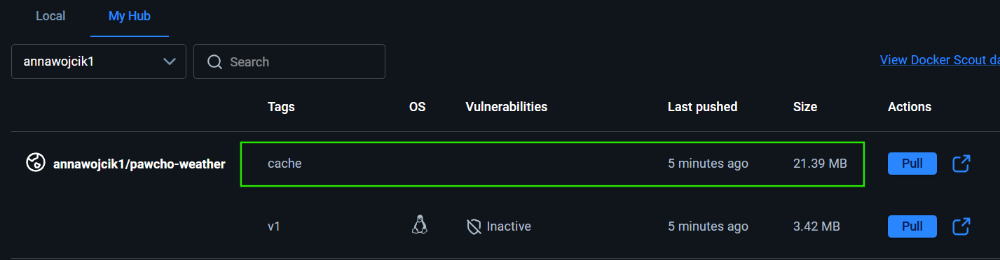

## Dowód poprawnego wykorzystania danych cache
Podczas procesu budowania obrazu, Buildx korzysta z tagu cache z repozytorium, zamiast budować wszytsko od nowa.

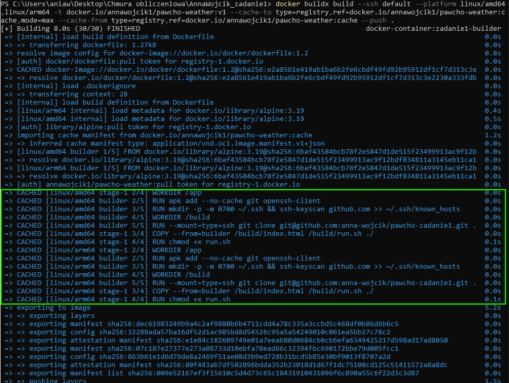

## Uruchomienia kontenera na podstawie zbudowanego obrazu
`docker run -d -p 3000:3000 --name=weatherApp docker.io/annawojcik1/pawcho-weather:v1`

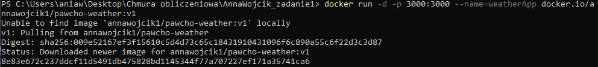

## Sposób uzyskania informacji z logów, które wygenerowałą opracowana aplikacja podczas uruchamiana kontenera
`docker logs weatherApp`

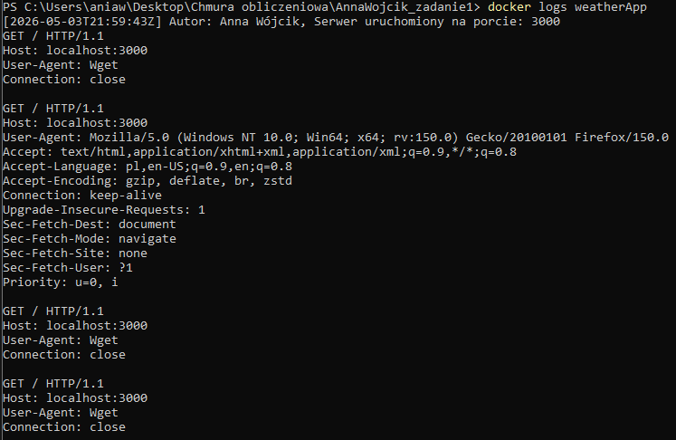

## Sprawdzenia, ile warstw posiada zbudowany obraz oraz jaki jest rozmiar obrazu.
Rozmiar obrazu: 11.54 MB</br>
Liczba warstw: 4

` docker history docker.io/annawojcik1/pawcho-weather:v1`
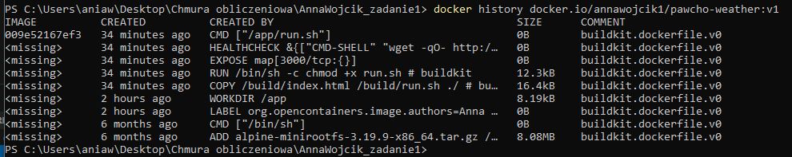

`docker images annawojcik1/pawcho-weather:v1`
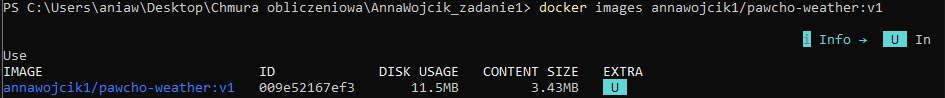

## Działająca aplikacja w przeglądarce
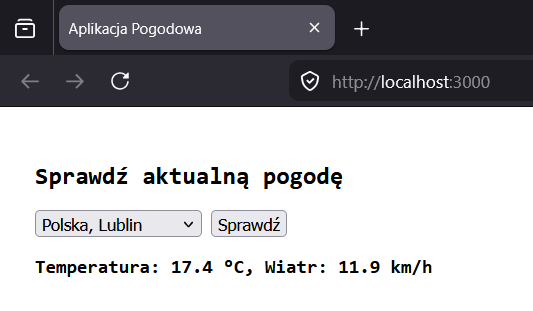

## Skanowanie podatności (CVE)
Przeprowadzono audyt bezpieczeństwa:</br>
`docker scout cves docker.io/annawojcik1/pawcho-weather:v1`

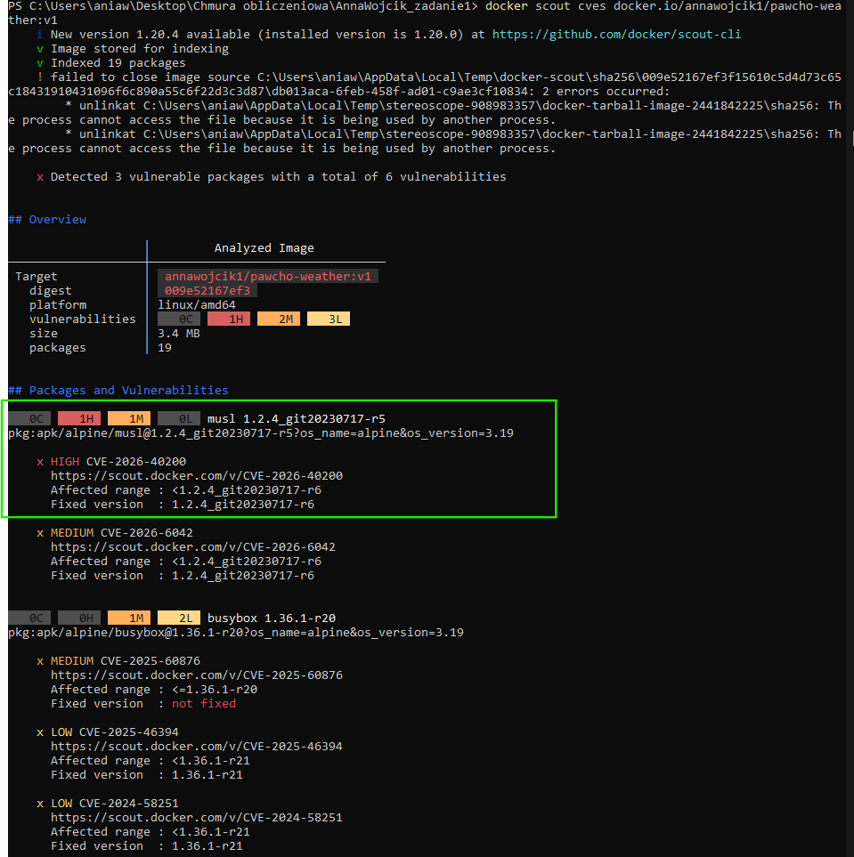
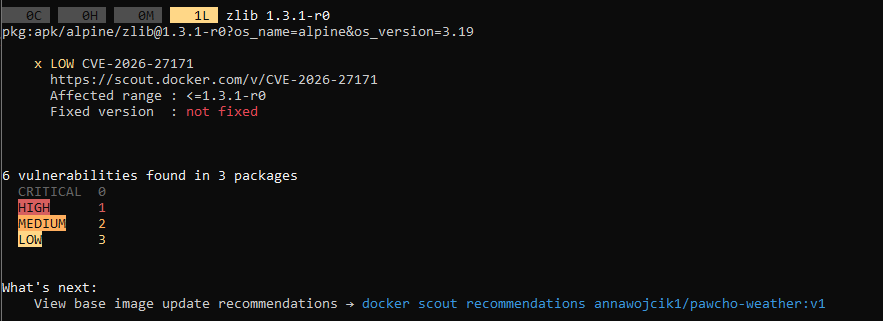

Skaner Docker Scout wykrył jedną podatność oznaczoną statusem HIGH w bibliotece systemowej musl.

Kontener uruchamia tylko bardzo ograniczony serwer oparty na programie Netcat, udostępniający statyczny plik HTML. Kontener nie przyjmuje z zewnątrz żadnych złożonych struktur danych, nie korzysta z dynamicznej alokacji pamięci na podstawie inputu użytkownika ani nie wykonuje zaawansowanych operacji na tekstach, w których biblioteka musl mogłaby zostać wykorzystana do przepełnienia bufora lub wstrzyknięcia kodu. Ze względu na minimalną powierzchnię ataku (atakujący może co najwyżej pobrać plik indeksu poprzez proste gniazdo TCP), ryzyko wykorzystania tego błędu w środowisku wynosi praktycznie zero.

Rozwiązanie: dodanie komendy `RUN apk upgrade --no-cache` do Dockerfile, aktualizującej pakiety i łatające podatności (w tym CVE-2026-40200 dla musl).

Po przebudowaniu obrazu, skaner nie wykrył podatności oznaczonej statusem HIGH lub CRITICAL.

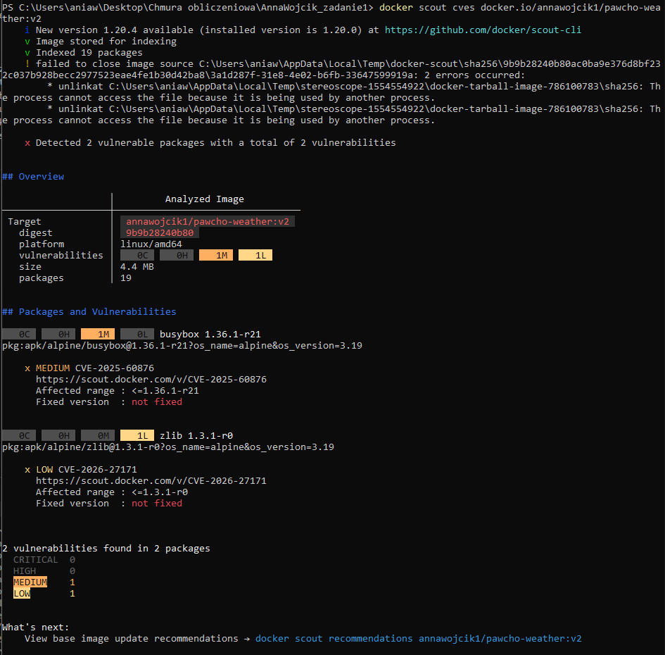