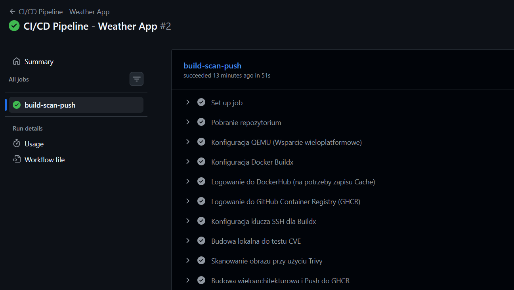
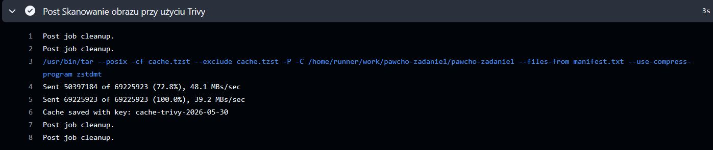
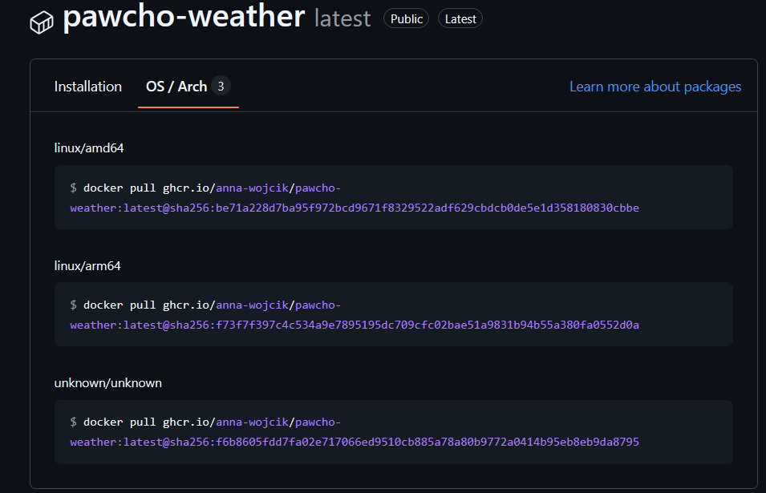

# Sprawozdanie - Zadanie 2 (CI/CD Pipeline)

**Autor:** Anna Wójcik  

**Link do obrazu w GHCR:** https://github.com/anna-wojcik/pawcho-zadanie1/pkgs/container/pawcho-weather  
**Link do Cache w DockerHub:** (https://hub.docker.com/repository/docker/annawojcik1/pawcho-weather/general)

## 1. Cel zadania

Celem zadania było opracowanie zautomatyzowanego łańcucha (pipeline'u) CI/CD w usłudze **GitHub Actions**. Łańcuch ten ma za zadanie zbudować wieloarchitekturowy obraz kontenera (na bazie ekstremalnie lekkiego serwera opartego o `BusyBox` z Zadania 1), przetestować go pod kątem luk bezpieczeństwa (CVE) i, w przypadku braku krytycznych zagrożeń, wypchnąć gotowy obraz do publicznego rejestru GitHub Container Registry (ghcr.io), a dane warstw tymczasowych (cache) zeskładować na platformie Docker Hub.

## 2. Wybór skanera podatności (CVE)

**Zastosowane narzędzie: AquaSecurity Trivy**

Do realizacji testu bezpieczeństwa wybrano skaner **Trivy** (zamiast narzędzia Docker Scout).
**Uzasadnienie:** Trivy jest narzędziem natywnie dostosowanym do zautomatyzowanych procesów CI/CD i posiada oficjalną, zoptymalizowaną akcję w środowisku GitHub Actions (`aquasecurity/trivy-action`). W przeciwieństwie do Docker Scout, nie wymaga on dodatkowego uwierzytelniania z zewnętrznymi serwerami analitycznymi ekosystemu Docker podczas samego skanu.
Co najważniejsze, Trivy oferuje wbudowany parametr `exit-code: '1'` powiązany bezpośrednio z flagą `severity: 'CRITICAL,HIGH'`. Oznacza to, że skaner samodzielnie zatrzyma z błędem cały łańcuch GitHub Actions w przypadku wykrycia poważnej luki, realizując tym samym warunek "testu blokującego wdrożenie" w sposób czysty i niewymagający pisania dodatkowych skryptów warunkowych.

## 3. Sposób tagowania obrazów

Zastosowano podwójne tagowania (Dual-Tagging) dla obrazów wypychanych do repozytorium GitHub Container Registry (ghcr.io):

1. **Tag dynamiczny `latest`:** Standard branżowy wskazujący na najnowszą, poprawnie zbudowaną i przetestowaną wersję aplikacji. Ułatwia to pobieranie obrazu przez użytkowników końcowych.
2. **Tag unikalny bazujący na hashu Git (`${{ github.sha }}`):** Gwarantuje stuprocentową identyfikowalność i powtarzalność. Każdy wypchnięty obraz jest powiązany z dokładnym hashem commita z kodu źródłowego.

**Uzasadnienie:** Zastosowanie identyfikatora commitu jako tagu (`sha`) to fundamentalna praktyka bezpieczeństwa łańcucha dostaw oprogramowania. Dzięki temu wiemy precyzyjnie, z jakiego stanu kodu powstał dany obraz kontenera. Pozwala to na błyskawiczne wycofanie zmian (rollback) w środowisku produkcyjnym do konkretnej, działającej wersji kodu, bez ryzyka, że tag został w międzyczasie nadpisany (co ma miejsce w przypadku używania wyłącznie tagu `latest`).

## 4. Zarządzanie warstwami Cache

Dane cache wykorzystywane przez silnik BuildKit są trzymane oddzielnie od głównego obrazu w architekturze rozproszonej.

**Zastosowana konfiguracja:**

- **Rejestr Docelowy:** Docker Hub (repozytorium `annawojcik1/pawcho-weather`)
- **Tag dla cache:** `:cache`
- **Tryb:** `mode=max`

**Uzasadnienie:** Użycie wariantu maksymalnego (`mode=max`) wymusza na silniku BuildKit zapisanie warstw pochodzących ze wszystkich etapów wieloetapowego pliku Dockerfile (w tym ciężkiego etapu `builder`, w którym instalujemy klienta Git, konfigurujemy SSH i klonujemy repozytorium). Tryb domyślny (`min`) zapisałby tylko warstwy finalnego obrazu, co nie zoptymalizowałoby w pełni czasu budowania.
Ponadto, cache jest wysyłany na Docker Hub pod specjalnie dedykowanym tagiem `:cache`. Takie rozwiązanie separuje archiwum tymczasowych warstw budowania od finalnego, czystego obrazu aplikacji (który trafia do GHCR). Zapobiega to zaśmiecaniu docelowego rejestru produkcyjnego (GHCR) gigabajtami danych tymczasowych.

## 5. Przebieg łańcucha

Opracowany plik `.github/workflows/ci-cd.yml` realizuje następujące kroki:

1. **Checkout:** Pobranie kodu źródłowego z repozytorium.
2. **Setup QEMU & Buildx:** Inicjalizacja środowiska wspierającego kompilację na architektury `linux/amd64` oraz `linux/arm64`.
3. **Login:** Logowanie do Docker Hub (dla Cache) oraz GHCR (dla docelowego obrazu) z użyciem bezpiecznych zmiennych środowiskowych (Secrets i Variables).
4. **SSH Agent:** Załadowanie prywatnego klucza SSH pozwalającego Dockerowi na uwierzytelnienie z GitHubem wewnątrz kontenera budującego.
5. **Budowa Testowa:** Zbudowanie obrazu lokalnie (tylko na runnerze, bez wypychania do sieci) na potrzeby audytu.
6. **Skanowanie CVE:** Uruchomienie skanera Trivy.
7. **Budowa Multi-arch & Push:** Jeśli skan przebiegł pomyślnie, Buildx kompiluje obraz na dwie platformy, wykorzystuje cache z Docker Huba, aktualizuje cache i wypycha gotowy obraz do GHCR.

## 6. Dowody poprawnego działania

### Sukces Pipline

### Wynik skanowania Trivy

### Obraz w GHCR
